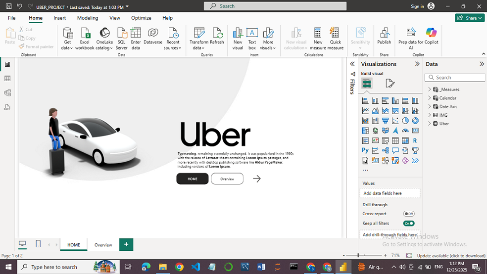
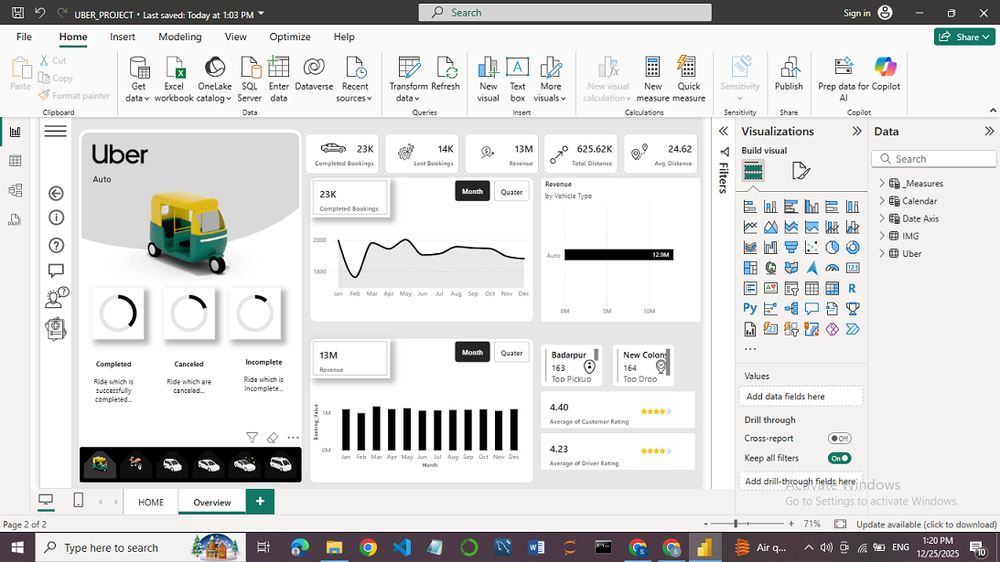
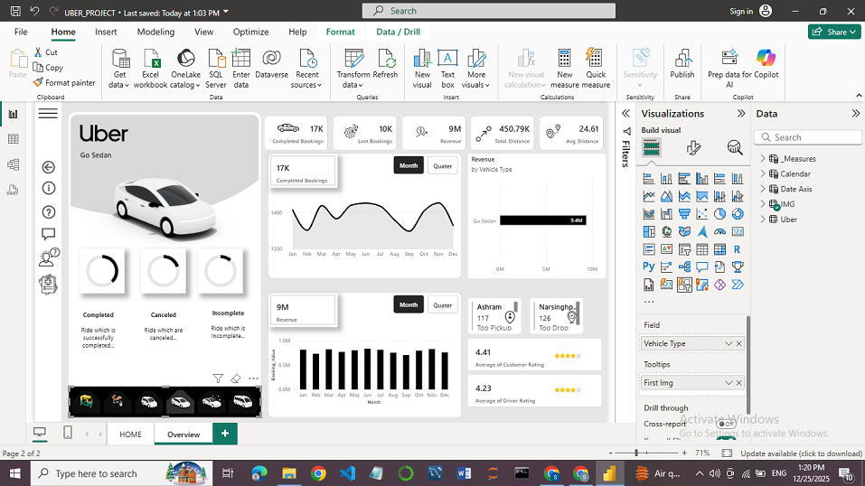
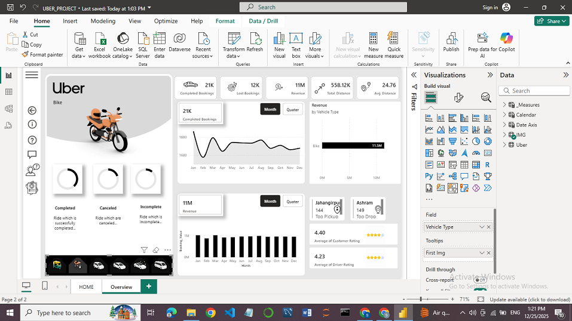

# Uber Rides Analysis Dashboard (Power BI)

## 📌 Project Overview
This project presents an interactive Power BI dashboard developed to analyze Uber ride data and extract actionable business insights.

## 🎯 Objectives
- Analyze ride demand and trip trends
- Identify peak hours and high-demand locations
- Understand revenue patterns
- Support data-driven transportation insights

## 📊 Dashboard Highlights
- Time-based ride analysis
- Trip volume and revenue KPIs
- Interactive filters for detailed exploration
## 📸 Dashboard Preview

### Dashboard View 1

### Dashboard View 2

### Dashboard View 3

### Dashboard View 4

*Figure: Interactive Power BI dashboards analyzing Uber ride trends, demand patterns, and KPIs.*

## 🛠 Tools & Technologies
- Power BI
- MS Excel
- Data Analysis
- Data Visualization

## 📂 Project Files
- `UBER_PROJECT.pbix` – Power BI dashboard file

## 🚀 How to Use
1. Download the `.pbix` file
2. Open it using Power BI Desktop
3. Explore insights using interactive visuals and slicers

## 🎯 Skills Demonstrated
- Business Intelligence
- Data Visualization
- Analytical Thinking
- Dashboard Design

## 👩‍💻 Author
Samrudhi
